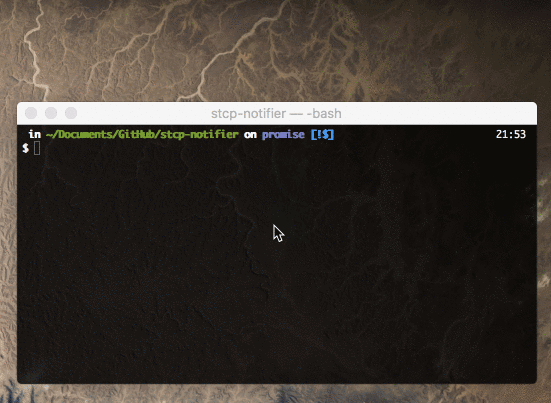

# Node STCP notifier CLI

Very simple Node.js application to scrap the [STCP website](http://www.stcp.pt) to get the ETA of the next buses at a bus stop.

## Motivation

With this application I don't have to keep refreshing their website and I can get a notification when I need to get out to the bus stop.
This way I don't loose my bus and I don't need to waste time waiting at the stop. :smile:

## Functionality
What it does:
- automatic requests every 30 seconds;
- filter results to a specific line;
- set notifications when bus is less than *x* minutes away.

## Demonstration

## Explanation

STCP provides a tool to see the remaining times of the buses at any of its bus stations.

The tool functions with unique station codes.
For example: `AAL1` in [`http://www.stcp.pt/pt/viajar/horarios/?paragem=AAL1&t=smsbus`](http://www.stcp.pt/pt/viajar/horarios/?paragem=AAL1&t=smsbus)

Peeking at the source code of the page, it was possible to discover a more stripped-down version of this tool at [`http://www.stcp.pt/itinerarium/soapclient.php?codigo=AAl1`](http://www.stcp.pt/itinerarium/soapclient.php?codigo=AAl1) which returns very little HTML and the information about the next buses.
Here is an example of the returned HTML:

~~~html

  

    [...]
  

<table id="smsBusResults" width="100%" cellpadding="0" cellspacing="0" border="0">
  <tr>
    <th>Linha</th>
    <th>Hora Prevista</th>
    <th>Tempo de Espera</th>
  </tr>
  <tr class="even">
    <td>
      <ul class="linhasAssoc">
        <li><a target="_self" class="linha_4m" title="" href="/pt/viajar/linhas/?linha=4M ">4M </a></li>
      </ul>
      &nbsp;AV. ALIADOS
    </td>
    <td><i>00:49</i></td>
    <td>3min</td>
  </tr>
  <tr class="even">
    <td>
      <ul class="linhasAssoc">
        <li><a target="_self" class="linha_3m" title="" href="/pt/viajar/linhas/?linha=3M ">3M </a></li>
      </ul>
      &nbsp;AV. ALIADOS
    </td>
    <td><i>00:53</i></td>
    <td>7min</td>
  </tr>
</table>
~~~

The information we want is in the table with id `smsBusResults` in each of its rows with class `even`.

## Getting Started

1. Clone or download this repo;

2. Open the directory in terminal;

3. Install Node modules with `npm install`;

4. Run the Node application with `node stcp.js <bus stop code>`.

5. For easier usage, you can *link* the module with `npm link`; now you can use the CLI with just `stcp <bus stop code>`.